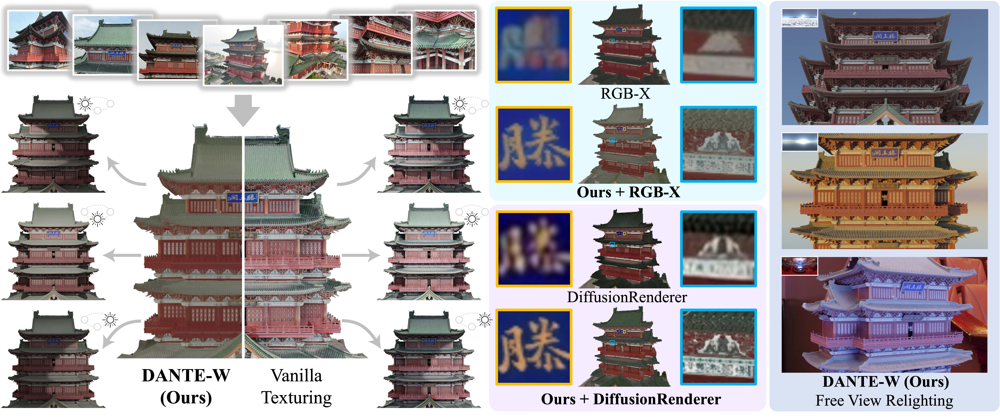
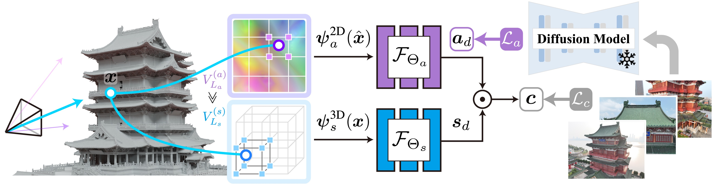

# 🫧 DANTE-W: Diffuse Albedo Neural Texturing in the Wild

This repository is the official implementation of the ECCV'26 paper titled "DANTE-W: Diffuse Albedo Neural Texturing in the Wild".

[](https://dante-wild.github.io/)
[](https://arxiv.org/abs/2403.19517)
[](https://huggingface.co/datasets/luciancosw/Pavilion-of-Prince-Teng/)

Guangyu Wang,
Tianheng Lu,
[Ruqi Huang](https://rqhuang88.github.io/),
[Lu Fang](http://www.luvision.net/)


We present DANTE-W, a neural texturing framework for high-fidelity diffuse albedo recovery in the wild. Compared to vanilla mesh texturing with baked-in lighting effects (e.g., noon-time shading and strong roof-edge shadowing on this pavilion), our method effectively disentangles a 3D-consistent diffuse albedo texture with exceptional photorealism. Leveraging physically principled neural rendering, DANTE-W faithfully reconstructs fine-grained albedo details, enabling hyper-realistic free-view relighting.

## 🌟 Methodology

Real-world lighting effects oftentimes manifest as lower frequencies compared to fine-grained albedo variations. Given a reconstructed mesh of the scene with surface parameterization, we represent diffuse albedo neural texture using a high-resolution 2D hash encoding and irradiance using a low-resolution 3D hash encoding. This explicit frequency-band discrepancy effectively facilitates the disentanglement between the two intrinsic components. We guide the low-frequency component of diffuse albedo with screen-space diffusion priors and recover fine-grained albedo details by neural rendering the raw observations.

## 📢 News
2024-06-26: [Paper](https://arxiv.org/abs/2403.19517) and code release. <br>
2026-06-18: Accepted to <b>ECCV 2026</b>. <br>

## 💻 Dependencies

Clone this repository to your local machine, create the environment and install dependencies using **conda** and <b>pip</b>:

```bash
conda create -n dantew python=3.9
conda activate dantew
pip install -r requirements.txt
```

This implementation primarily relies on [pytorch](https://pytorch.org/), [pytorch-lightning](https://lightning.ai/docs/pytorch/stable/), [tinycudann](https://github.com/NVlabs/tiny-cuda-nn), and [nvdiffrast](https://github.com/NVlabs/nvdiffrast).

The code was tested on:
- Ubuntu 20.04, Python 3.9.16, CUDA 12.1, GeForce RTX 3090
- Ubuntu 24.04, Python 3.9.19, CUDA 12.4, A100

## ⚡️ Quick start

### 📷 Data preparation
Download the sample data of the example scene **Pavilion of Prince Teng** from this [HuggingFace link](https://huggingface.co/datasets/luciancosw/Pavilion-of-Prince-Teng/) and organize the downloaded files into a folder namely ```Pavilion_of_Prince_Teng```, with the file structure as follows:
```
Pavilion_of_Prince_Teng  
├── data_noon     
│   ├── images_4  
│   │   ├── IMGNAME1.JPG       
│   │   ├── IMGNAME2.JPG       
│   │   └── ...        
│   ├── cams_4         
│   │   ├── IMGNAME1_cam.txt   
│   │   ├── IMGNAME2_cam.txt   
│   │   └── ...            
│   └── albedo_4  
│       ├── IMGNAME1.jpg       
│       ├── IMGNAME2.jpg       
│       └── ...       
├── 1_tex.mtl
├── 1_tex.obj
├── 6.mtl
└── 6.obj     
```
where `images_4` stores the captured multi-view RGB images, ```cams_4``` stores the camera parameters (in [MVSNet](https://github.com/YoYo000/MVSNet/tree/master) convention), and ```albedo_4``` stores the diffuse albedo predictions from [DiffusionRenderer](https://github.com/nv-tlabs/cosmos-transfer1-diffusion-renderer). The ```.obj``` files are the reconstructed mesh of the scene aligned with the cameras, `1_tex.obj` is a highly-accurate mesh with over 9M faces and `6.obj` is the decimated version with 0.5M faces.

### 🛠️ Config 
All configs are stored in ```configs/parameter.py```. Make sure to properly set the following parameters before running the code:

- `exp_id`: The ID naming for the current run.
- `_input_data_rootFld`: The root data path containing the downloaded data, e.g., if the absolute path for ```Pavilion_of_Prince_Teng``` is ```/data/guangyu/dataset/Pavilion_of_Prince_Teng```, then `_input_data_rootFld` should be set as ```/data/guangyu/dataset```.
- `root_file`: The root path to store the training logs, checkpoints, and the texturing results.
- `load_checkpoint_dir`: The absolute path to load the specified ckpt for inference or further training. Set as `None` when training from scratch.
- `input_mesh_resol`: Set as `1_tex` if the mesh with 9M faces is used, and set as `6` if the mesh with 0.5M faces is used.

### ⬇ Ray caching
Prior to training, pre-cache the sliced rasterization buffers in disk. This saves, for each foreground pixel of each image, the rasterized `xyz` and `uv` coordinates and the cooresponding RGB colour. Run by:
```bash
cd agents
python caching.py
```

### 🚀 Training (Texture optimization)
Use the following script to launch training:
```bash
python ray_train.py
```
The optimization is conducted by iteratively sampling a random batch of cached rays across all images and performing stochastic gradient descent with neural rendering loss and diffusion prior. The training is highly efficient, only taking several minutes.

### 🖥️ Inference
After optimization, a standard texture map can be readily exported. To do so, first specify `load_checkpoint_dir` as the absolute path of the saved checkpoint, and then run by:
```bash
python texturing.py
```
This will generate a texture map in the format of `.jpg` in root_file/point_exp/Pavilion_of_Prince_Teng/data_noon/texture_map. 

To visualize the resulting texture, one can use Blender to import the mesh as an *object* first, then open *Shader Editor* and select this *object* and import the diffuse albedo map from the disk for *Base Color*. The texture can be displayed using the *Viewport Shading* mode.

An alternative is to modify the associated `.mtl` file by writing the name of the resulting `.jpg` after *map_ao*, and use simpler tools for visualization.

## 🔥 Detailed usage on custom scenes

### 📸 Prepare images

Carefully collect the multi-view images, since mesh reconstruction quality is 100% tied to view sampling density.

### 🎮 Multi-view 3D reconstruction (A.K.A. Photogrammetry)

Estimate per-image camera parameters and reconstruct the dense geometry (in the form of triangle mesh) of the scene. Here we recommond to use off-the-shelf software **Agisoft Metashape** or **COLMAP** to finish this step:

- **Using Agisoft Metashape:**
 
    - Command-line Interface: specify the configs (including file names and parameters for reconstruction) and then run by ```python -u scripts/run_metashape.py```. The default parameters generally work well for most real-world scenes.
    - GUI: follow the Basic Workflow in [Metashape User Manuals](https://www.agisoft.com/downloads/user-manuals/).

- **Using COLMAP:** Please refer to the official documentation for [command-line interface](https://colmap.github.io/cli.html#) or [GUI](https://colmap.github.io/tutorial.html).

After photogrammetry, export the undistorted images, camera parameters, and the reconstructed mesh model ```YourMeshName.obj```.

### 🔮 Diffusion inference
We recommond using [DiffusionRenderer](https://github.com/nv-tlabs/cosmos-transfer1-diffusion-renderer) to generate diffuse albedo maps for the undistorted images in a *per-image* manner, since we find the video mode of DiffusionRenderer is not always stable and our neural texturing by design ensures 3D-consistency. Please follow their official instructions to generate the albedo map for each image.

### ⚙️ File formats
Organize the above results in the folder ```SCENE_NAME``` as follows:
```
SCENE_NAME (e.g., Pavilion_of_Prince_Teng)
└── DATA_NAME (e.g., data_noon)                          
    ├── images_{dsp_factor}                 
    │   ├── IMGNAME1.JPG       
    │   ├── IMGNAME2.JPG       
    │   └── ...                
    ├── cams_{dsp_factor}                   
    │   ├── IMGNAME1_cam.txt   
    │   ├── IMGNAME2_cam.txt   
    │   └── ...             
    └── albedo_{dsp_factor}
    │   ├── IMGNAME1.jpg       
    │   ├── IMGNAME2.jpg       
    │   └── ...     
    └── YourMeshName.obj             
```

The camera convention used in our codestrictly follows [MVSNet](https://github.com/YoYo000/MVSNet/tree/master), where the camera parameters are defined in the ```.txt``` file, with the extrinsic `E = [R|t]` and intrinsic `K` being expressed as:

```
extrinsic
E00 E01 E02 E03
E10 E11 E12 E13
E20 E21 E22 E23
E30 E31 E32 E33

intrinsic
K00 K01 K02
K10 K11 K12
K20 K21 K22
```

### 🔄 Camera conversion

- For **Agisoft Metashape**, convert the resulting metashape camera file ```cams.xml``` to the ```cams``` folder using ```scripts/xml2txt.py```, where the following parameters are needed to be specified:

    - ```dsp_factor```: the down-sample rate, e.g., ```dsp_factor=4``` means down-sampling the resulting images and the related intrinsic parameters by a factor of 4.

    - ```subject_file```: the root path contains the exported image folder ```images``` and ```cams.xml```.

    The outputs are the two folders namely ```images_{dsp_factor}``` and ```cams_{dsp_factor}```.

- For **COLMAP**, please refer to [MVSNet/mvsnet/colmap2mvsnet.py](https://github.com/YoYo000/MVSNet/blob/master/mvsnet/colmap2mvsnet.py).

### 🛠️ Settings
Make sure to properly set the following configs in ```configs/parameter.py``` before running the code:

- Root configs (`root_params`):
    - `exp_id`: The ID for the current run.
    - `_input_data_rootFld`: The root data path containing the downloaded data, e.g., if the absolute path for ```Pavilion_of_Prince_Teng``` is ```/data/guangyu/dataset/Pavilion_of_Prince_Teng```, then `_input_data_rootFld` should be set as ```/data/guangyu/dataset```.
    - `root_file`: The root path to store the training logs, checkpoints, and also the render results.
    - `load_checkpoint_dir`: The absolute path to load the specified ckpt for inference or further training. Set as `None` when training from scratch.

- Data loading configs (`load_params`):
    - `modelName` and `splitName`: Set as the `SCENE_NAME` and `DATA_NAME`, respectively. The folder `images_{dsp_factor}` and `cams_{dsp_factor}`, and the mesh `YourMeshName.obj` should be saved in `datasetFolder/modelName/splitName/..`
    - `input_mesh_resol`: Set as `YourMeshName`.
    - `all_view_list`: Specify the list of view_id (from 0 to the total number of the images / cameras) to be included from `images_{dsp_factor}` and `cams_{dsp_factor}`.

### DANTE-W Training and inference
Follow 1) [⬇ Ray caching](#-ray-caching), 2) [🚀 Training (Texture optimization)](#-training-texture-optimization), and 3) [🖥️ Inference](#️-inference) in the session of [**⚡️ Quick start**](#️-quick-start) to generate the diffuse albedo texture map.


## 🎓 Citation

If you find our code or data helpful, please cite our paper:

```bibtex
@InProceedings{Wang_2024_CVPR,
    author    = {Wang, Guangyu and Zhang, Jinzhi and Wang, Fan and Huang, Ruqi and Fang, Lu},
    title     = {XScale-NVS: Cross-Scale Novel View Synthesis with Hash Featurized Manifold},
    booktitle = {Proceedings of the IEEE/CVF Conference on Computer Vision and Pattern Recognition (CVPR)},
    month     = {June},
    year      = {2024},
    pages     = {21029-21039}
}